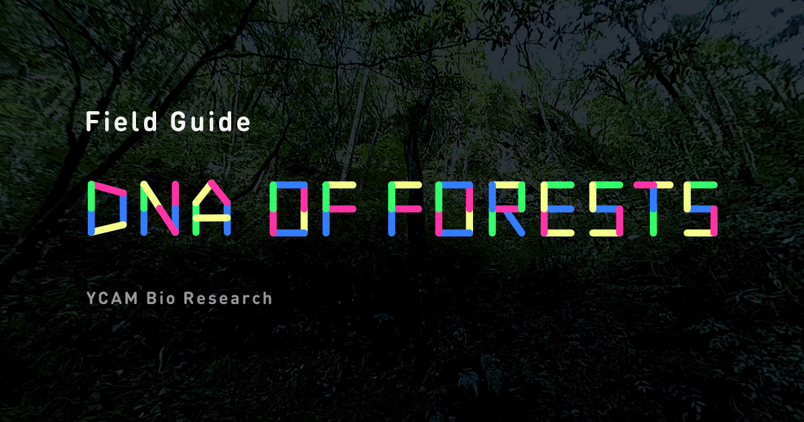

# Field Guide “DNA of Forests”

The middleman project for the website **Field Guide “DNA of Forests”**.

- English ver. [http://dna-of-forests.ycam.jp/en/](http://dna-of-forests.ycam.jp/en/)
- Japanese ver. [http://dna-of-forests.ycam.jp/](http://dna-of-forests.ycam.jp/)

## Table of contents


<!-- MarkdownTOC depth="0" bracket="round" autolink="true" indent="    " -->

- [Getting started](#getting-started)
    - [Set up environments and install dependencies](#set-up-environments-and-install-dependencies)
    - [Start middleman server](#start-middleman-server)
    - [Doesn't work?](#doesnt-work)
- [Tips and tools for development](#tips-and-tools-for-development)
    - [Remove sound from movie file](#remove-sound-from-movie-file)
- [Licenses](#licenses)
    - [Exception list](#exception-list)

<!-- /MarkdownTOC -->

## Getting started

### Set up environments and install dependencies

This instruction shows a strict way for the users who are not familiar with the ruby and node. If you are an expert, please skip these instructions.

First of all, please install [rbenv](https://github.com/rbenv/rbenv) and [ndenv](https://github.com/riywo/ndenv) by yourself.

Then follow this instruction.

```sh
# clone this repository
git clone --recursive https://github.com/YCAMInterlab/dna-of-forests.git

# move into project dirctory
cd dna-of-forests

# node setup --------

# check the node version
# this command will show you target node version in this project
cat .node-version

# install the specific version node
# you must replace 'x.x.x' part with the result above
ndenv install x.x.x

# check you are using correct version in case
ndenv versions

# install dependencies
npm install

# ruby setup --------

# check the ruby version
# this command will show you target ruby version in this project
cat .ruby-version

# install the specific version ruby
# you must replace 'x.x.x' part with the result above
rbenv install x.x.x

# check you are using correct version in case
rbenv versions

# install bundler
rbenv exec gem install bundler

# install dependencies
rbenv exec bundle install --path=vendor/bundle --binstubs=vendor/bin
```

### Start middleman server

```sh
rbenv exec bundle exec middleman
```

Then you can preview site on these URLs

- English ver. [http://localhost:4567/dna-of-forests/en/](http://localhost:4567/dna-of-forests/en/)
- Japanese ver. [http://localhost:4567/dna-of-forests/](http://localhost:4567/dna-of-forests/)

Now you can modify files under `source` directory.

Ref: [Middleman](https://middlemanapp.com/)

### Doesn't work?

Please try updating dependencies.

```sh
rbenv exec bundle update
npm update
```


## Tips and tools for development

### MP3 encode with Lame

```sh
lame -V2 forest.wav forest.mp3
```

### Remove sound from movie file

[AudioRemover](http://www.audioremover.com/)

## Licenses

Field Guide “DNA of Forests” by [YCAM InterLab](https://github.com/YCAMInterlab) and [Karappo Inc.](https://github.com/karappo) is licensed under the [Apache License, Version2.0](http://www.apache.org/licenses/LICENSE-2.0.html) (**except the files in [the list](#exception-list) below**)

### Exception list

- [Font files licensed from "Google Fonts"](https://github.com/YCAMInterlab/dna-of-forests/tree/source/source/dna-of-forests/font)
- [Images files in slide](https://github.com/YCAMInterlab/dna-of-forests/tree/source/source/dna-of-forests/img/about/slides)
- [Vendor files](https://github.com/YCAMInterlab/dna-of-forests/tree/source/source/dna-of-forests/vendor)

```
Copyright 2016-2017 YCAM InterLab and Karappo Inc.

Licensed under the Apache License, Version 2.0 (the "License");
you may not use this file except in compliance with the License.
You may obtain a copy of the License at

   http://www.apache.org/licenses/LICENSE-2.0

Unless required by applicable law or agreed to in writing, software
distributed under the License is distributed on an "AS IS" BASIS,
WITHOUT WARRANTIES OR CONDITIONS OF ANY KIND, either express or implied.
See the License for the specific language governing permissions and
limitations under the License.
```
